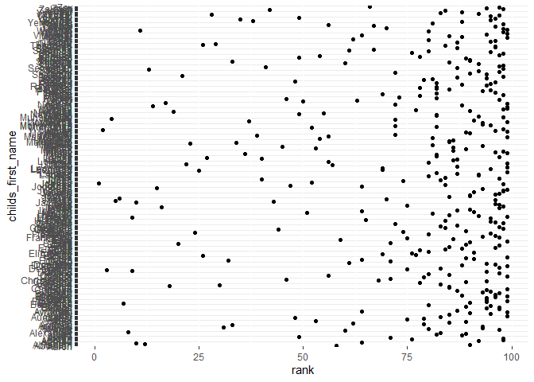

p8105\_hw2\_xl2934
================
Xiaoyang Li
2019/9/27

# Problem 1

## Read and clean the Mr. Trash Wheel sheet

``` r
trashwheel = 
  read_excel(
    path = "./data/HealthyHarborWaterWheelTotals2018-7-28.xlsx",
    range = "A2:N52",
    sheet = "Professor Trash Wheel"
    ) %>% 
  janitor::clean_names() %>% 
  drop_na(dumpster) %>% 
  mutate(sports_balls = as.integer(sports_balls))
trashwheel
```

    ## # A tibble: 34 x 14
    ##    dumpster month  year date                weight_tons volume_cubic_ya~
    ##    <chr>    <chr> <dbl> <dttm>                    <dbl>            <dbl>
    ##  1 1        Janu~  2017 2017-01-02 00:00:00        1.79               15
    ##  2 2        Janu~  2017 2017-01-30 00:00:00        1.58               15
    ##  3 3        Febr~  2017 2017-02-26 00:00:00        2.32               18
    ##  4 4        Febr~  2017 2017-02-26 00:00:00        3.72               15
    ##  5 5        Febr~  2017 2017-02-28 00:00:00        1.45               15
    ##  6 6        March  2017 2017-03-30 00:00:00        1.71               15
    ##  7 7        April  2017 2017-04-01 00:00:00        1.82               15
    ##  8 8        April  2017 2017-04-20 00:00:00        2.37               15
    ##  9 9        May    2017 2017-05-10 00:00:00        2.64               15
    ## 10 10       May    2017 2017-05-26 00:00:00        2.78               15
    ## # ... with 24 more rows, and 8 more variables: plastic_bottles <dbl>,
    ## #   polystyrene <dbl>, cigarette_butts <dbl>, glass_bottles <dbl>,
    ## #   grocery_bags <dbl>, chip_bags <dbl>, sports_balls <int>,
    ## #   homes_powered <dbl>

## Read and clean precipitation data from 2017 and 2018

``` r
prec_2018 = 
  read_excel(
    path = "./data/HealthyHarborWaterWheelTotals2018-7-28.xlsx", 
    sheet = "2018 Precipitation",
    range = "A2:B14") %>% 
  mutate(
    year = "2018")

prec_2017 = 
  read_excel(
    path = "./data/HealthyHarborWaterWheelTotals2018-7-28.xlsx", 
    sheet = "2017 Precipitation",
    range = "A2:B14") %>% 
  mutate(
    year = "2017")

prec = bind_rows(prec_2017, prec_2018) %>% 
  janitor::clean_names() 
prec = mutate(prec, month = month.name[pull(prec, month)])
```

## Write about data

For `trashwheel`, there are 34 observations after omiting non-data rows
and non dumpster-specific rows. The median number of sports balls in a
dumpster in 2017 is 0. In this dataset, `dumpster` is key variable as
far as I am concerned. It contain the unique value in this dataset so
that it can help mark every observation. Also, it map to unique date,
which make it possible to merge this dataset to others.

For `prec`, there are 24 observations after omiting NAs. The total
precipitation in 2018 is NA. The key variable in this dataset is
`total`, which represent the preciptation in every month.

# Problem 2

## clean the data in pols-month.csv.

``` r
pols_month = read_csv(file = "./data/pols-month.csv") %>% 
  separate(mon, c("year", "month", "day")) %>% 
  mutate(
    year = as.numeric(year), 
    month = as.numeric(month)) 
  
pols_month = mutate(pols_month, month = month.name[pull(pols_month, month)]) %>% 
  pivot_longer( 
    c("prez_gop", "prez_dem"), 
    names_to = "president", 
    names_prefix = "prez_") %>% 
  select(-value, -day)
pols_month
```

    ## # A tibble: 1,644 x 9
    ##     year month    gov_gop sen_gop rep_gop gov_dem sen_dem rep_dem president
    ##    <dbl> <chr>      <dbl>   <dbl>   <dbl>   <dbl>   <dbl>   <dbl> <chr>    
    ##  1  1947 January       23      51     253      23      45     198 gop      
    ##  2  1947 January       23      51     253      23      45     198 dem      
    ##  3  1947 February      23      51     253      23      45     198 gop      
    ##  4  1947 February      23      51     253      23      45     198 dem      
    ##  5  1947 March         23      51     253      23      45     198 gop      
    ##  6  1947 March         23      51     253      23      45     198 dem      
    ##  7  1947 April         23      51     253      23      45     198 gop      
    ##  8  1947 April         23      51     253      23      45     198 dem      
    ##  9  1947 May           23      51     253      23      45     198 gop      
    ## 10  1947 May           23      51     253      23      45     198 dem      
    ## # ... with 1,634 more rows

## clean the data in snp.csv

``` r
snp = read_csv(file = "./data/snp.csv") %>% 
  separate(date, c("month", "day", "year")) %>% 
  mutate(
    month = as.numeric(month), 
    day = as.numeric(day), 
    year = as.numeric(year)
    ) %>% 
  arrange(year, month) %>% 
  select( year, month, everything(), -day)

snp = mutate(snp, month = month.name[pull(snp, month)])
snp
```

    ## # A tibble: 787 x 3
    ##     year month     close
    ##    <dbl> <chr>     <dbl>
    ##  1  1950 January    17.0
    ##  2  1950 February   17.2
    ##  3  1950 March      17.3
    ##  4  1950 April      18.0
    ##  5  1950 May        18.8
    ##  6  1950 June       17.7
    ##  7  1950 July       17.8
    ##  8  1950 August     18.4
    ##  9  1950 September  19.5
    ## 10  1950 October    19.5
    ## # ... with 777 more rows

## join the datasets

``` r
pol_snp = left_join(pols_month, snp, by = c("year", "month"))

unemployment = read_csv(file = "./data/unemployment.csv") %>% 
  rename(
    "year" = "Year",
    "January" = "Jan",
    "February" = "Feb",
    "March" = "Mar",
    "April" = "Apr",
    "June" = "Jun",
    "July" = "Jul",
    "August" = "Aug",
    "September" = "Sep",
    "October" = "Oct",
    "November" = "Nov",
    "December" = "Dec"
    ) %>% 
  pivot_longer(
    January:December,
    names_to = "month",
    values_to = "umemploy_%"
  ) 
  
pol_snp_unemploy = left_join(pol_snp, unemployment, by = c("year", "month"))
summary(pol_snp_unemploy)
```

    ##       year         month              gov_gop         sen_gop    
    ##  Min.   :1947   Length:1644        Min.   :12.00   Min.   :32.0  
    ##  1st Qu.:1964   Class :character   1st Qu.:18.00   1st Qu.:42.0  
    ##  Median :1981   Mode  :character   Median :22.00   Median :46.0  
    ##  Mean   :1981                      Mean   :22.48   Mean   :46.1  
    ##  3rd Qu.:1998                      3rd Qu.:28.00   3rd Qu.:51.0  
    ##  Max.   :2015                      Max.   :34.00   Max.   :56.0  
    ##                                                                  
    ##     rep_gop         gov_dem        sen_dem         rep_dem   
    ##  Min.   :141.0   Min.   :17.0   Min.   :44.00   Min.   :188  
    ##  1st Qu.:176.0   1st Qu.:22.0   1st Qu.:48.00   1st Qu.:211  
    ##  Median :195.0   Median :28.0   Median :53.00   Median :250  
    ##  Mean   :194.9   Mean   :27.2   Mean   :54.41   Mean   :245  
    ##  3rd Qu.:222.0   3rd Qu.:32.0   3rd Qu.:58.00   3rd Qu.:268  
    ##  Max.   :253.0   Max.   :41.0   Max.   :71.00   Max.   :301  
    ##                                                              
    ##   president             close           umemploy_%   
    ##  Length:1644        Min.   :  17.05   Min.   : 2.50  
    ##  Class :character   1st Qu.:  83.60   1st Qu.: 4.70  
    ##  Mode  :character   Median : 137.26   Median : 5.60  
    ##                     Mean   : 472.85   Mean   : 5.83  
    ##                     3rd Qu.: 936.31   3rd Qu.: 6.90  
    ##                     Max.   :2107.39   Max.   :10.80  
    ##                     NA's   :72        NA's   :24

``` r
str(pol_snp_unemploy)
```

    ## Classes 'tbl_df', 'tbl' and 'data.frame':    1644 obs. of  11 variables:
    ##  $ year      : num  1947 1947 1947 1947 1947 ...
    ##  $ month     : chr  "January" "January" "February" "February" ...
    ##  $ gov_gop   : num  23 23 23 23 23 23 23 23 23 23 ...
    ##  $ sen_gop   : num  51 51 51 51 51 51 51 51 51 51 ...
    ##  $ rep_gop   : num  253 253 253 253 253 253 253 253 253 253 ...
    ##  $ gov_dem   : num  23 23 23 23 23 23 23 23 23 23 ...
    ##  $ sen_dem   : num  45 45 45 45 45 45 45 45 45 45 ...
    ##  $ rep_dem   : num  198 198 198 198 198 198 198 198 198 198 ...
    ##  $ president : chr  "gop" "dem" "gop" "dem" ...
    ##  $ close     : num  NA NA NA NA NA NA NA NA NA NA ...
    ##  $ umemploy_%: num  NA NA NA NA NA NA NA NA NA NA ...

## write about datasets

For `pols_month`, It contain year, month, gov\_gop, sen\_gop, rep\_gop,
gov\_dem, sen\_dem, rep\_dem, president. For `snp`, It containyear,
month, close. For `unemployment`, It containyear, month, umemploy\_%.
For the resulting dataset, `pol_snp_unemploy`, there are 1644
observations and 11 variables. This dataset record from 1947 to 2015.
The key variables used to merge different dataset is `year` and `month`.

# Problem 3

## Load and tidy the data

``` r
names = read_csv(file = "./data/Popular_Baby_Names.csv") %>% 
  janitor::clean_names() %>% 
  distinct() %>% 
  mutate(ethnicity = recode(ethnicity, 
                            "ASIAN AND PACI" = "ASIAN AND PACIFIC ISLANDER", 
                            "BLACK NON HISP" = "BLACK NON HISPANIC", 
                            "WHITE NON HISP" = "WHITE NON HISPANIC"),
         childs_first_name = str_to_title(childs_first_name))
```

## produce new tables of “Olivia” and most popular male name

``` r
pop_olivia = filter(names, childs_first_name == "Olivia", gender == "FEMALE") %>% 
  select(year_of_birth, ethnicity, rank) %>% 
  pivot_wider(
    names_from = "ethnicity",
    values_from = "rank"
  )

pop_male = filter(names, gender == "MALE", rank == 1) %>% 
  select(year_of_birth, ethnicity, childs_first_name)%>% 
  pivot_wider(
    names_from = "ethnicity",
    values_from = "childs_first_name"
  )
```

## produce a scatter plot for male, white non-hispanic children born in 2016

``` r
scatter_samp = filter(names, 
                      gender == "MALE", 
                      ethnicity == "WHITE NON HISPANIC", 
                      year_of_birth == 2016) %>% 
  select(childs_first_name, rank)

ggplot(scatter_samp, aes(x = rank, y = childs_first_name)) + 
  geom_point()
```

<!-- -->
